# @braebo/ansi

ANSI code helpers for node.js and chrome.

<br>

-   Hex -> True Color
-   TypeScript / ESM
-   Handles gradients
-   Colorizes objects
-   Dependency free
-   Lightweight <sup>(1.3kb minified brotli)</sup>
-   Tree shakable

<br>

## Install

```zsh
# npm
pnpm i -D @braebo/ansi

# jsr
pnpm dlx jsr add @braebo/ansi
```

<br>

## Usage

### Hex

Create colors from hex values:

```typescript
import { ansiHex } from '@braebo/ansi'

const coral = ansiHex('#FF7F50')
console.log(coral('This text will be coral colored'))
```

<br>

### Style

Create styles from the `ansiStyle` function:

```typescript
import { ansiStyle } from '@braebo/ansi'

const bold = ansiStyle('bold')
console.log(bold('This text will be bold'))
```

<br>

### Gradient

Interpolate gradients with any number of colors:

```ts
import { ansiGradient } from '@braebo/ansi'

// Create a gradient function.
const g = ansiGradient('#38b2db', '#5959b5', '#e84067')
```

Now that we have a gradient function, we can pass it a string:

```ts
console.log(g('Simple gradient text.'))
```

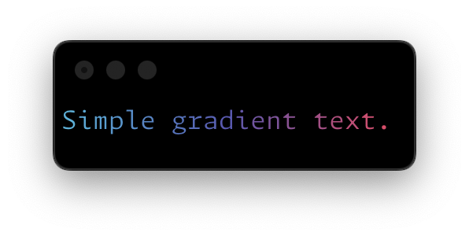

Or pass it a number to get a color stop:

```ts
const fade = `
${g(0.5)}■■■■■■■■■■■■
${g(0.0)}■■■■■■■■■■■■
${g(0.9)}■■■■■■■■■■■■
${CLEAR}`

console.log(fade)
```

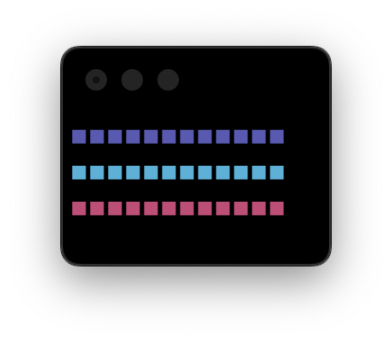

### Mini Methods

Colored logging can quickly become unweildy, so I like to use the mini methods for common colors and styles:

```typescript
import { l } from '@braebo/ansi' // console.log

import { r, g, b } from '@braebo/ansi' // Colors
import { d, bd, em } from '@braebo/ansi' // Styles

// Colors
l(r('red'))
l(g('green'))
l(b('blue'))

// Styles
l(d('dimmed'))
l(bd('bold'))
l(em('italic'))
```

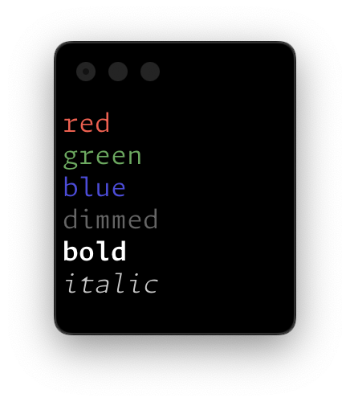

If no arguments are provided, the mini methods will return the ANSI code:

```ts
console.log(r() + 'red', y() + 'yellow', g() + 'green')
```

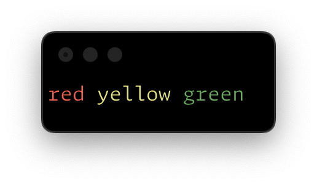

> [!NOTE]
> When no string is provided to a mini method, it won't be wrapped in a corresponding reset code.
> Use the clear method (`clr()`) to reset the styles yourself.

<br>

### `logger`

The `logger` function used by the mini methods is somewhat involved, so I decided to expose / document it.  It can be used to create your own custom logging functions that colorize input dynamically.

```ts
const err = logger({
	prefix: r('| '),
	printWidth: 20,
	fn: (...args: any[]) => {
		console.log(r('>'), r(bd('ERROR')))
		console.log(...args)
	},
})

err('Something went wrong:', { ok: false, cause: '¯\\_(ツ)_/¯' })
```

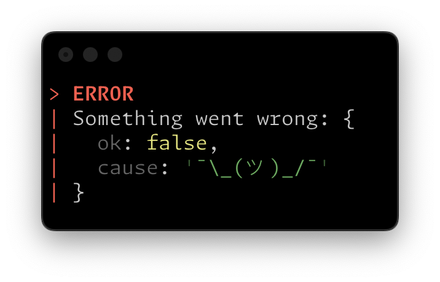

<br>

### `LogOptions`

The `logger` function accepts the following options:

<br>

#### `printWidth`

Controls the expansion of objects and arrays into multiline output.

> @default `60`

```ts
const l = logger({ printWidth: 50 })
l({ foo: true, bar: [1, 'two', { three: () => 3 }] })
```


> [!NOTE]
> Internally, `printWidth` is calculated somewhat roughly, so this option is generally a ballpark estimate.

<br>

#### `inline`

Forces inputs into either inline or multiline output.

> @default `undefined`

```ts
const l = logger({ inline: true })
l({ foo: true, bar: [1, 'two', { three: () => 3 }] })
```

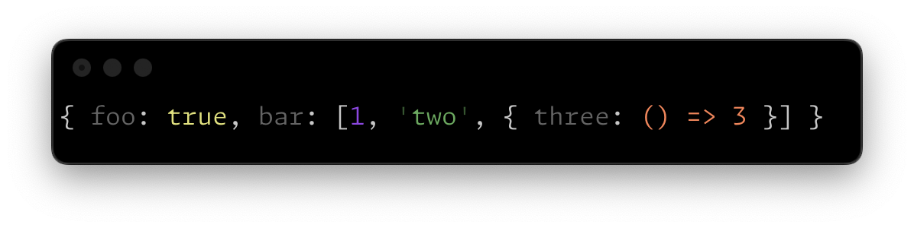

Add `__inline__` to an object for a granular overrides.

```ts
l({
	one: 1,
	two: 2,
	nested: { __inline__: true, one: 1, two: 2, three: 3 },
})
```

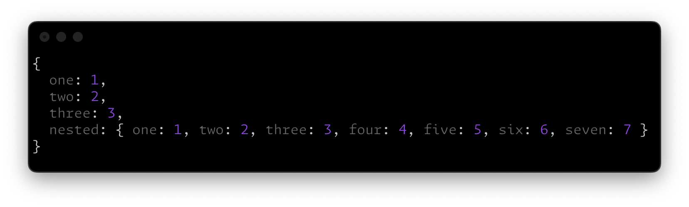

For array overrides, use the strings `__inline__` and `__multiline__` to force inline or multiline output.

```ts
l([true, 1, 'two', () => 3, '__multiline__'])
```

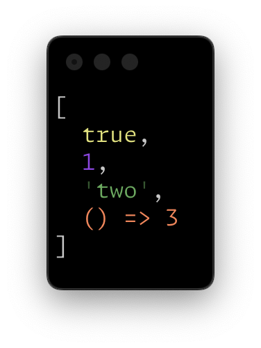

<br>

#### `delimiter`

The delimiter used between rest args.

> @default `' '`

```ts
const l = logger({ delimiter: c(' · ') })
l(true, 1, 'two', () => 3)
```

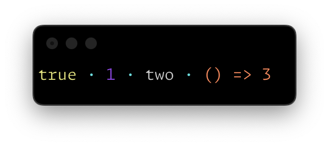

<br>

#### `prefix`

A prefix to prepend to each line (works with multiline output).

> @default `''`

```ts
const l = logger({ prefix: c('⌇ '), delimiter: '' })
l('# ', bd('Header'))
l()
l(d('<p>'), em('Hello, world!'), d('</p>'))
```

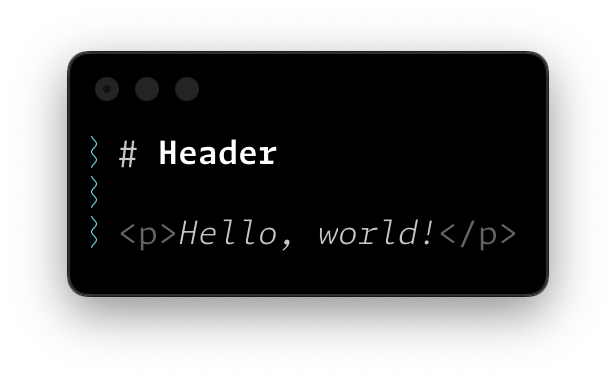

<br>

#### `fn`

A custom logger function.

> @default `console.log`

```ts
const l = logger({ fn: console.warn })
l('E-gad!')
```

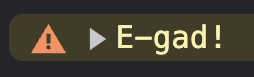

<br>

### `paint()`

The `paint` function used by `logger` can be used directly to colorize arbitrary input:

```ts
console.log(
	paint(
		{
			num: 123,
			bool: true,
			str: 'foo',
			fn: () => 'bar',
		},
		{ inline: false }
	)
)
```

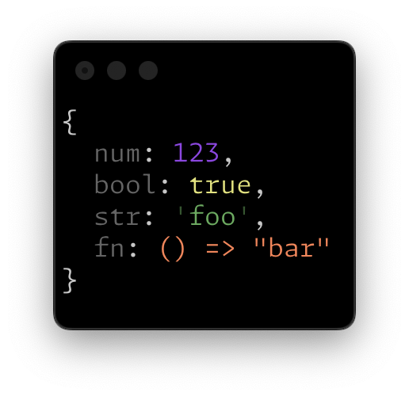

### Why

NIH syndrome / copy-paste fatigue.

<br>

### License

MIT © [braebo](https://github.com/braebo)
