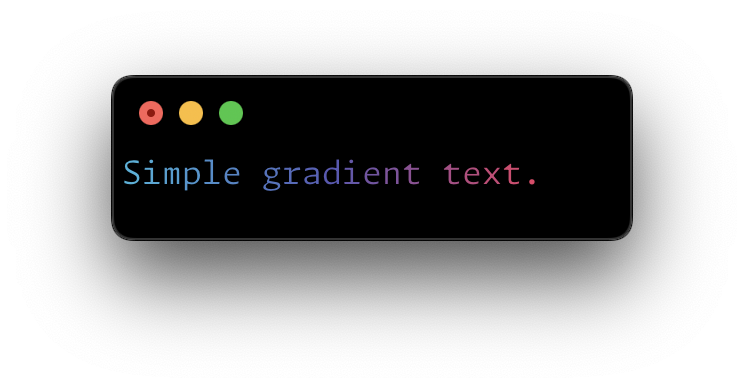
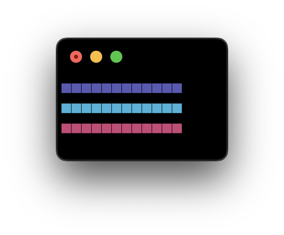
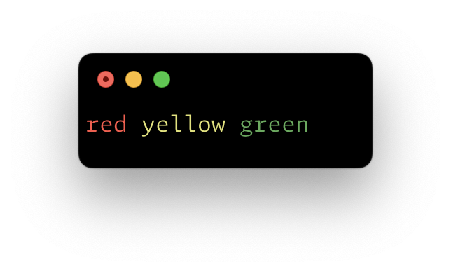

# @braebo/ansi

ANSI code helpers for node.js and chrome.

<br>

-   Hex -> True Color
-   TypeScript / ESM
-   Handles gradients
-   Colorizes objects
-   Dependency free
-   Lightweight <sup>(1.3kb minified brotli)</sup>
-   Tree shakable

<br>

## Install

```zsh
# npm
pnpm i -D @braebo/ansi

# jsr
pnpm dlx jsr add @braebo/ansi
```

<br>

## Usage

### Hex

Create colors from hex values:

```typescript
import { ansiHex } from '@braebo/ansi'

const coral = ansiHex('#FF7F50')
console.log(coral('This text will be coral colored'))
```

<br>

### Style

Create styles from the `ansiStyle` function:

```typescript
import { ansiStyle } from '@braebo/ansi'

const bold = ansiStyle('bold')
console.log(bold('This text will be bold'))
```

<br>

### Gradient

Interpolate gradients with any number of colors:

```ts
import { ansiGradient } from '@braebo/ansi'

// Create a gradient function.
const g = ansiGradient('#38b2db', '#5959b5', '#e84067')
```

Now that we have a gradient function, we can pass it a string:

```ts
console.log(g('Simple gradient text.'))
```



Or pass it a number to get a color stop:

```ts
const fade = `
${g(0.5)}■■■■■■■■■■■■
${g(0.0)}■■■■■■■■■■■■
${g(0.9)}■■■■■■■■■■■■
${CLEAR}`

console.log(fade)
```



### Mini Methods

Colored logging can quickly become unweildy, so I like to use the mini methods for common colors and styles:

```typescript
import { l } from '@braebo/ansi' // console.log

import { r, g, b } from '@braebo/ansi' // Colors
import { d, bd, em } from '@braebo/ansi' // Styles

// Colors
l(r('red'))
l(g('green'))
l(b('blue'))

// Styles
l(d('dimmed'))
l(bd('bold'))
l(em('italic'))
```


If no arguments are provided, the mini methods will return the ANSI code:

```ts
console.log(r() + 'red', y() + 'yellow', g() + 'green')
```



> [!NOTE]
> When no string is provided to a mini method, it won't be wrapped in a corresponding reset code.
> Use the clear method (`clr()`) to reset the styles yourself.

<br>

### `logger`

The `logger` function can be used to create your own custom logging functions that colorize input dynamically.

```ts
const l = logger()

l([1, 2], true, { foo: 'bar' })
```


### `LogOptions`

The `logger` function accepts the following options:

<br>

#### `prefix`

A prefix to prepend to the log.

> @default `''`

```ts
const l = logger({ prefix: c('⌇ ') })

l(bd('Result'))
l()
l([1, 2], true, { foo: 'bar' })
```


#### `delimiter`

A delimiter to use between rest args.

> @default `' '`

```ts
const l = logger({ delimiter: c(' · ') })

l([1, 2], true, { foo: 'bar' })
```


#### `inline`

Whether to print objects in a single line.

> @default `false`

```ts
const l = logger({ inline: true })

l([1, 2], true, { foo: 'bar' })
```

> [!NOTE]
> Use `__inline__` for granular overrides 👇
>
> ```ts
> l([1, 2], true, { foo: 'bar', __inline__: true })
> ```


#### `fn`

A custom logger function.

> @default `console.log`

<br>

Pass a built-in method:

```ts
const l = logger({ fn: console.warn })

l('E-gad!')
```


<br>

Or make a custom one:

```ts
const err = logger({
	prefix: r('| '),
	fn: (...args: any[]) => {
		console.log(r('>'), r(bd('ERROR')))
		console.log(...args)
	},
})

err('Something went wrong:', { cause: '¯\\_(ツ)_/¯' })
```


<br>

### Pretty Printing

The `paint_primitive` and `paint_object` functions used by `logger` can be used directly:

```ts
import { paint_object } from '@braebo/ansi'

const pretty = paint_object({ foo: 'bar', baz: [1, 2, { three: 3 }] }, { inline: false })

console.log(pretty)
```


```ts
import { paint_primitive } from '@braebo/ansi'

const num = paint_primitive(123)
const bool = paint_primitive(true)
const str = paint_primitive('true')

console.log(num, bool, str)
```


### Browser Compatibility

Full color support is available in Chromium browsers and Node.js environments.

Safari and Firefox fall back to plain text output due to lack of support for ANSI codes.

<br>

### Why

NIH syndrome / copy-paste fatigue.

<br>

### License

MIT © [braebo](https://github.com/braebo)
